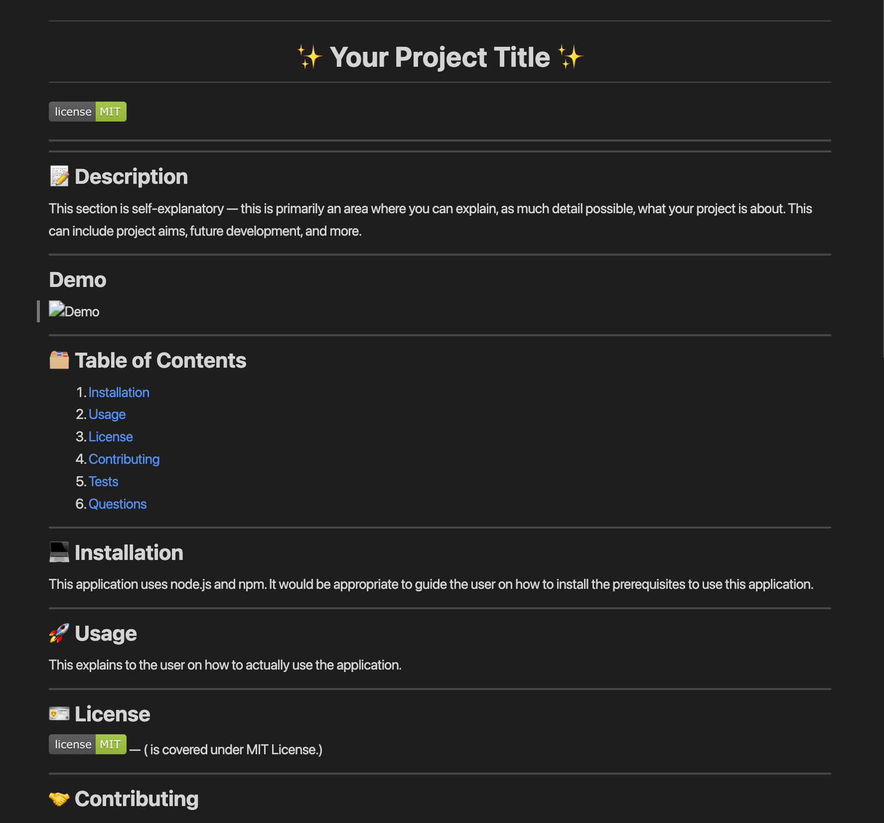

# <h1 align="center">**✨ CLI README Generator ✨**</h1>

## 📝 **Description**
This application is a README generator using Node.js via the Command Line Interface. The generator supposedly is purposed to create a README file much more conveniently saving time and effort, which are of course crucial factors to a project.

## **Demo**

## 🗂️ **Table of Contents**
1. [Installation](#installation)
2. [Usage](#usage)
3. [License](#license)
4. [Contributing](#contributing)
5. [Tests](#tests)
6. [Questions](#questions)

## 💻 **Installation** 
Install `Node.js` and `npm`, to your local machine by running `node install -y`, to fully experience this application. Using `npm`, install the `inquirer` package by entering into the terminal: `npm i inquirer@ 6.3.1`.

## 🚀 **Usage** 
First, `fork` the repository into your personal GitHub workspace and `clone` the project — this is so that you have your own personal copy of the application. Open the application to explore the project files if you wish. To start the application, open a `terminal` and locate to the `root` directory. Then, type `node index js`. A series of prompts will appear instantly to allow you to enter your answers in. If successful, the current `README.md` will be created, and updated with every iteration.

## 🪪 **License** 
 — (<Project-Title> is covered under MIT License.)

## 🤝 **Contributing** 
This is to explicitly advice the users on how to effectively work on the project as collaborators via following a set of parameters.

## 🛠️ **Tests** 
This area is to document different possible tests, possibly showing code too, to show the user that the application could work using a variety of code.

## ❔ **Questions** 
Any queries about this project, please feel welcome to reach out to me using the following credentials:
<h3>Josh Capito</h3>
- Github: <a href="https://github.com/jemcap">Josh Capito</a>
 
- Email: <a href="mailto:joshuaecapito22@gmail.com">joshuaecapito22@gmail.com</a>

